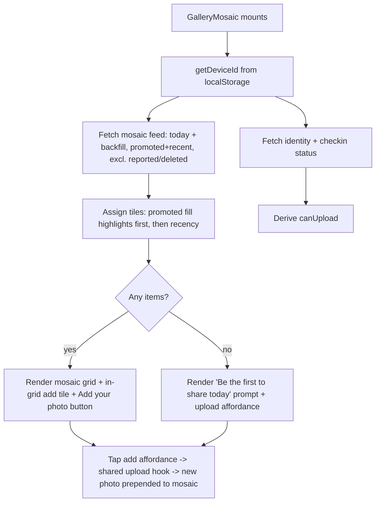

# feat: Gallery mosaic on payment-confirmed screens

## Summary

Embed a shared gallery mosaic into both post-payment surfaces — the in-flow check-in "done" screen and the `/success` page — so every paying villager sees recent community uploads as social proof and can add their own photo in place. The mosaic is a dense grid with recency- and moderator-promotion-driven highlighted tiles, prefers today's photos with recent backfill, excludes reported/removed content, and is fed by a dedicated read path. A new `promoted_at` column plus an admin toggle let moderators push standout photos into the highlighted spots.

---

## Problem Frame

The gallery is the studio's community feed but is nearly undiscoverable — no global nav, only a secondary button after check-in and a footer link on `/here` (see origin: `docs/brainstorms/2026-06-30-gallery-payment-screen-requirements.md`). The post-payment moment is the highest-attention point in the flow and the point at which a villager has just become eligible to upload (upload is gated on same-day check-in). Today that moment is a dead-end confirmation screen. This plan converts it into a social-proof + contribution surface.

Two implementation realities shape the work, both confirmed during research:
- The public gallery read (`web/src/app/api/gallery/route.ts`) filters only `deleted_at`, so reported photos are currently shown until an admin takes them down. The high-visibility mosaic must additionally exclude reported items.
- The upload pipeline (re-encode → presign → PUT → register) is inline in `web/src/app/gallery/page.tsx` and must be lifted into a shared hook so the mosaic and the existing gallery page use one pipeline.

---

## Key Technical Decisions

- **Shared mosaic component, self-fetching identity.** A single `GalleryMosaic` component renders on both screens (origin R11, R12). It self-fetches viewer identity and check-in status from the device id (`getDeviceId()` → `/api/villager`, `/api/checkin/status`), so it works on `/success` where no server session exists. This resolves the origin's open question about `/success` identity.
- **Dedicated mosaic read path, existing feed untouched.** Add a mosaic-scoped read (new route or `scope` param) that applies today-with-backfill, promotion ordering, and reported/removed exclusion, leaving the existing `/gallery` feed behavior unchanged. Reported-exclusion is applied to the mosaic only this round; the main feed's behavior is unchanged (deferred — see Scope Boundaries).
- **Extract a shared upload hook.** Lift `reencodePhoto`, `uploadOne`, the size/type constants, and the identity/check-in derivation out of `web/src/app/gallery/page.tsx` into a shared hook, and refactor the existing gallery page onto it. One pipeline, no duplicated upload logic.
- **Promotion as a nullable timestamp.** Add `uploads.promoted_at timestamptz`. A timestamp (not a boolean) makes "newest-promoted wins" overflow ordering fall out naturally when more photos are promoted than there are highlight slots. Promotion is metadata-only; R2 storage is untouched.
- **Highlight assignment is a single replaceable rule.** Tile assignment fills highlighted (2×2) slots with promoted items first (newest `promoted_at` first), then recency fills any remaining highlight slots (origin R3, R14). The rule lives in one place so a future engagement signal can replace the recency portion (origin Key Decisions).
- **Reuse existing report/removal for moderation-safety.** No new approval workflow — exclusion relies on the existing `reported` flag plus removal (owner soft-delete sets `deleted_at`; admin takedown is a hard delete). Both are excluded from the mosaic (origin Key Decisions).

---

## High-Level Technical Design

Mosaic data flow (both screens share the component):



Tile-assignment rule (directional guidance, not implementation spec):

```text
highlightSlots = N          # layout-defined count of 2x2 spots
promoted = items.filter(promoted_at != null).sortDesc(promoted_at)
recent   = items.filter(not in promoted).sortDesc(created_at)
highlights = (promoted ++ recent).take(highlightSlots)
standard   = remaining items in recency order
```

---

## Requirements Traceability

This plan implements origin requirements R1–R14, flows F1–F4, and acceptance examples AE1–AE6 from `docs/brainstorms/2026-06-30-gallery-payment-screen-requirements.md`. Mapping to units:

- Mosaic display (R1–R6) → U2, U4
- Upload affordances (R7–R10) → U3, U4
- Placement (R11, R12) → U5, U6
- Moderation and curation (R13, R14) → U1, U2, U7

---

## Implementation Units

### U1. Add `promoted_at` column to uploads

- **Goal:** Persist moderator promotion as a nullable timestamp on uploads.
- **Requirements:** R14 (supports R3).
- **Dependencies:** none.
- **Files:**
  - `supabase/migrations/<timestamp-after-20260625120000>_uploads_promoted.sql` (create)
- **Approach:** `alter table uploads add column promoted_at timestamptz;` plus a partial index for promotion ordering: `create index idx_uploads_promoted on uploads (promoted_at desc) where deleted_at is null and not reported;`. Use a migration timestamp strictly later than the current latest (`20260625120000`), following the `YYYYMMDDHHMMSS_snake_case.sql` convention.
- **Patterns to follow:** existing `supabase/migrations/20260625120000_uploads.sql` column + partial-index style.
- **Test scenarios:** Test expectation: none — schema-only migration with no behavioral logic. Verification covers application.
- **Verification:** Migration applies cleanly against a fresh DB; `uploads.promoted_at` exists and defaults to null; the partial index is created.

### U2. Mosaic read path (today-with-backfill, promotion ordering, exclusions)

- **Goal:** Provide a read endpoint that returns mosaic-ready items: today's uploads with recent backfill, promoted flag/ordering, excluding reported and soft-deleted items.
- **Requirements:** R1, R3, R4, R13, R14.
- **Dependencies:** U1.
- **Files:**
  - `web/src/app/api/gallery/route.ts` (modify — add a `scope=mosaic` branch) or a new `web/src/app/api/gallery/mosaic/route.ts` (create); pick one and keep the existing default feed behavior unchanged.
  - `web/src/lib/upload-helpers.ts` (reference `todayBounds()`)
  - test: `web/src/app/api/gallery/__tests__/mosaic.test.ts` (create) or the repo's established API-test location
- **Approach:** Select `id, kind, content_type, object_key, created_at, promoted_at, villager_id, villagers!inner(display_name)` with `.is("deleted_at", null).eq("reported", false)`. Build the result set as a union of three live, non-excluded groups so promotion is never windowed out: (a) all promoted items (`promoted_at is not null`) regardless of date, (b) today's items (via `todayBounds()`), and (c) most-recent prior items as backfill when (a)+(b) are below the layout target. Deduplicate, and include `promoted_at` (or a derived `promoted` boolean) per item so the client can assign tiles. Presign each `object_key` via `presignDownloadUrl` exactly as the existing feed does; drop items whose presign returns null. Keep the handler dynamic (DB + presign at request time; do not set `force-static`).
- **Patterns to follow:** existing query, `villagerName` embed handling, and presign loop in `web/src/app/api/gallery/route.ts`; `todayBounds()` in `web/src/lib/upload-helpers.ts`.
- **Test scenarios:**
  - Covers AE5. Reported item is excluded: a row with `reported = true` does not appear in the response.
  - Soft-deleted (`deleted_at` set) and hard-deleted items are excluded.
  - Covers AE1. On a day with several uploads, today's items are returned with `promoted_at` present on promoted rows.
  - Covers AE6. A promoted item from an older day (outside the today+backfill window) is still included in the response.
  - Covers AE2, F3. When today has fewer items than the layout target, the response backfills with most-recent prior items so total reaches the target.
  - Covers AE3, F3. When no non-excluded items exist, the response is empty (drives the empty state in U4).
  - When R2 is unconfigured, the response signals not-configured and returns no items (mirror existing feed).
- **Verification:** Endpoint returns mosaic items honoring exclusions and backfill; the existing `/gallery` feed response is byte-for-byte unchanged.

### U3. Extract shared upload hook from the gallery page

- **Goal:** Lift the upload pipeline and viewer/check-in derivation into a reusable hook, and refactor the existing gallery page onto it without behavior change.
- **Requirements:** R9 (enables R7, R8, R10 reuse).
- **Dependencies:** none (can land before or alongside U2).
- **Files:**
  - `web/src/lib/use-gallery-upload.ts` (create) — or `web/src/hooks/`/`web/src/components/gallery/` per repo convention
  - `web/src/app/gallery/page.tsx` (modify — consume the hook, remove inline duplicates)
  - test: `web/src/lib/__tests__/use-gallery-upload.test.ts` (create)
- **Approach:** Export `reencodePhoto`, the size/type constants (`ACCEPT`, `PHOTO_MAX_DIM`, caps, `JPEG_QUALITY`), `uploadOne(file, deviceId)` (presign → PUT → register), and an orchestration entry that uploads a selection sequentially while tracking progress/failures. Also expose the viewer identity + `checkedIn` + `canUpload` derivation so both consumers share it. The gallery page keeps its current UI but delegates logic to the hook. No contract change to `/api/upload/presign` or `/api/upload`.
- **Patterns to follow:** current `reencodePhoto`, `uploadOne`, and the identity/check-in `useEffect` in `web/src/app/gallery/page.tsx`.
- **Test scenarios:**
  - `uploadOne` performs presign → PUT → register in order and surfaces the registered item on success.
  - Photo exceeding the photo cap throws before presign; video exceeding the video cap throws before presign.
  - A failed presign / failed storage PUT / failed register each surface a descriptive error and do not register a phantom item.
  - `canUpload` is false when not configured, when identity is missing, or when not checked in today; true otherwise.
- **Verification:** Existing `/gallery` upload + browse behavior is unchanged; the hook is importable and used by both the gallery page and the mosaic (U4).

### U4. GalleryMosaic component

- **Goal:** A shared component rendering the dense mosaic with highlighted tiles, in-grid + explicit upload affordances, in-place upload, and the empty state.
- **Requirements:** R1, R2, R3, R5, R6, R7, R8, R10, R13, R14.
- **Dependencies:** U2, U3.
- **Files:**
  - `web/src/components/gallery/gallery-mosaic.tsx` (create)
  - test: `web/src/components/gallery/__tests__/gallery-mosaic.test.tsx` (create)
- **Approach:** The component accepts an optional `deviceId?: string` prop and falls back to `getDeviceId()` when it is absent, so it works whether the host passes the id (done screen, U5) or not (`/success`, U6). On mount, fetch the mosaic feed (U2) and viewer identity/check-in (via the U3 hook). Assign tiles per the highlight rule (promoted first, then recency, into the layout's highlight slots; remainder in recency order). Render a dense grid where highlighted items span a larger (≈2×2) tile; photos as ``, videos as `<video preload="metadata">`, each with the uploader display name overlay (and "(you)" when owned), mirroring the existing gallery tile. Include an in-grid dashed "Add yours" tile (R7) and an explicit secondary "Add your photo" button (R8); both invoke the shared upload hook, open the device picker, upload in place, and prepend the new photo to the mosaic (R10). When the feed is empty, render a "Be the first to share today" prompt with an upload affordance instead of a grid (R5). Use `Reveal`/`Stagger` from `@/components/motion` for entrance and CSS variables (`--color-accent`, `--color-border`, etc.) + `font-[family-name:var(--font-domaine)]` for styling.
- **Patterns to follow:** tile rendering, name overlay, and video handling in `web/src/app/gallery/page.tsx`; motion + styling conventions in `web/src/components/checkin-flow.tsx` and `web/src/app/globals.css`.
- **Test scenarios:**
  - Covers AE6. Given a promoted item that is not the most recent, it occupies a highlighted (larger) tile ahead of more-recent non-promoted items.
  - Covers AE1. Given several items, the grid renders highlighted + standard tiles with name overlays; the in-grid add tile is present.
  - Covers AE3. Given an empty feed, the "Be the first to share today" prompt renders instead of a grid, with an upload affordance.
  - Covers AE4. Tapping "Add your photo" uploads via the hook and prepends the new photo to the mosaic without navigation.
  - When the viewer is not checked in / identity missing, upload affordances reflect the disabled state (no upload attempted).
  - Owned items show "(you)"; videos render as playable video tiles.
- **Verification:** Component renders correctly in both healthy and empty states, assigns highlights by the rule, and completes an in-place upload that appears in the grid.

### U5. Integrate the mosaic into the check-in done screen

- **Goal:** Show the mosaic on the in-flow post-check-in "done" screen.
- **Requirements:** R11 (and via the component R1, R7, R8).
- **Dependencies:** U4.
- **Files:**
  - `web/src/components/checkin-flow.tsx` (modify — render `<GalleryMosaic />` in the `done` branch)
  - test: extend `web/src/components/__tests__/checkin-flow.test.tsx` if present, else create
- **Approach:** In the `done` render branch, insert `<GalleryMosaic deviceId={deviceId} />` between the payment/subscription thank-you `Reveal` and `<CommunityLinks />`. Keep "See who's here" as the primary CTA; the mosaic's "Add your photo" is the secondary upload ask (origin R8 decision). Pass `deviceId` (already a prop) so the mosaic need not re-resolve it.
- **Patterns to follow:** the `done` branch layout and `Reveal` usage in `web/src/components/checkin-flow.tsx`.
- **Test scenarios:**
  - Covers F1. On reaching the `done` step, the mosaic renders above `CommunityLinks` and "See who's here" remains the primary button.
  - The done screen still renders correctly for the subscription and cash-paid variants with the mosaic present.
- **Verification:** Done screen shows confirmation → mosaic → "See who's here" (primary) + "Add your photo" (secondary); existing done-screen behavior intact.

### U6. Integrate the mosaic into the /success page

- **Goal:** Show the same mosaic on the online-payment return page.
- **Requirements:** R12 (and via the component R1, R7, R8).
- **Dependencies:** U4.
- **Files:**
  - `web/src/app/success/page.tsx` (modify — render `<GalleryMosaic />`)
  - test: `web/src/app/success/__tests__/page.test.tsx` (create)
- **Approach:** The page is a client component with no villager identity in the URL. Render `<GalleryMosaic />` between the confirmation heading and the "Back to Home" link; the component self-resolves the device id via `getDeviceId()` and fetches identity/check-in itself (U4), so no server session is needed. Keep the existing `Suspense`/`useSearchParams` heading intact.
- **Patterns to follow:** existing structure of `web/src/app/success/page.tsx`; `getDeviceId()` from `@/lib/device-id`.
- **Test scenarios:**
  - Covers F2. The mosaic renders on `/success` between the confirmation and "Back to Home".
  - With no device id present (fresh browser), the page still renders without error (mosaic shows empty/disabled affordance, no crash).
- **Verification:** `/success` shows the same mosaic experience as the done screen; the existing payment-complete heading and "Back to Home" link remain.

### U7. Moderator promote-to-highlight control

- **Goal:** Let an admin/moderator promote or unpromote an upload to a highlighted tile.
- **Requirements:** R14 (supports R3).
- **Dependencies:** U1 (column); benefits from U2 (ordering) for visible effect.
- **Files:**
  - `web/src/app/api/admin/gallery/[id]/route.ts` (modify — add `PATCH` accepting `{ promoted: boolean }`)
  - `web/src/app/api/admin/gallery/route.ts` (modify — add `promoted_at` to the GET select and mapped response so the panel badge has data)
  - `web/src/components/admin/gallery-panel.tsx` (modify — add promote toggle + "Highlighted" badge, extend `AdminUpload` with `promoted_at`)
  - test: `web/src/app/api/admin/gallery/__tests__/promote.test.ts` (create)
- **Approach:** Add a `PATCH` handler gated by `verifyAdmin(req)` (return the denial response if non-null) that sets `promoted_at = new Date().toISOString()` when promoting and `null` when unpromoting, modeled on the allow-listed field update in `web/src/app/api/admin/checkins/[id]/route.ts`. In the panel, add a per-card toggle using the existing `apiFetch` Bearer wrapper and render a "Highlighted" badge when `promoted_at` is set. Include `promoted_at` in the admin gallery list response so the badge reflects current state.
- **Patterns to follow:** `verifyAdmin` guard + `apiFetch` Bearer pattern; `PUT` allow-listed update in `web/src/app/api/admin/checkins/[id]/route.ts`; takedown button wiring in `web/src/components/admin/gallery-panel.tsx`.
- **Test scenarios:**
  - Covers F4. `PATCH` with `{ promoted: true }` sets `promoted_at`; `{ promoted: false }` clears it.
  - `PATCH` without a valid admin token is rejected by `verifyAdmin` (401/503), no DB write.
  - The admin gallery list response includes `promoted_at` so the panel can render the "Highlighted" badge.
  - After promoting, the mosaic read path (U2) orders the promoted item into a highlight slot.
- **Verification:** Admin can toggle promotion from the panel; promoted items surface in the mosaic's highlighted tiles; non-admins cannot promote.

---

## Scope Boundaries

### Deferred to Follow-Up Work

- Applying reported-exclusion to the main `/gallery` feed (the feed currently shows reported items until takedown). This plan limits the change to the mosaic per the confirmed scope; fixing the feed is a separate, low-risk follow-up.

### Deferred for later (from origin)

- A persistent/global gallery navigation entry.
- Letting non-checked-in villagers upload (the check-in gate stays).
- Swapping the highlight rule's recency portion to an engagement signal.

### Outside this brief (from origin)

- Building a reactions/likes system. The highlight rule accommodates one later; none is built here.

---

## Risks & Dependencies

- **Refactor blast radius (U3).** Extracting the upload hook touches the working `/gallery` page. Mitigation: refactor with no behavior change and cover the hook with tests (U3) before the mosaic consumes it.
- **Performance on the post-payment screen.** The mosaic loads several presigned media URLs inline at a high-traffic moment. Mitigation: cap the item count to the layout target, lazy-load media, and keep the read path's presign loop bounded.
- **Migration ordering.** The new migration must use a timestamp later than `20260625120000` to apply in order.
- **Next.js 16 conventions.** Dynamic route params are async (`await params`) and GET handlers stay dynamic by default — do not set `force-static` on the mosaic read. Consult `node_modules/next/dist/docs/` per `web/AGENTS.md` before writing route handlers.

---

## Open Questions

### Deferred to implementation

- Exact tile counts and number of highlight slots, and the "thin" threshold that triggers backfill (U2, U4) — tune to the layout once built.
- Whether the mosaic read is a `scope=mosaic` branch on the existing route or a dedicated `mosaic` route (U2) — pick during implementation; keep the existing feed unchanged either way.
- The repo's canonical location/convention for the shared hook and component test files (U3, U4) — follow existing test placement once confirmed.

---

## Sources & Research

- Origin requirements: `docs/brainstorms/2026-06-30-gallery-payment-screen-requirements.md`.
- Gallery feed + inline upload pipeline: `web/src/app/gallery/page.tsx`.
- Gallery read API (filters only `deleted_at`, not `reported`): `web/src/app/api/gallery/route.ts`.
- Upload lifecycle + check-in gate: `web/src/app/api/upload/presign/route.ts`, `web/src/app/api/upload/route.ts`, `web/src/lib/upload-helpers.ts`, `web/src/lib/upload-token.ts`.
- R2 helpers (types, caps, presign): `web/src/lib/r2.ts`.
- Done screen + motion/styling conventions: `web/src/components/checkin-flow.tsx`, `web/src/components/motion/`, `web/src/app/globals.css`.
- Online-payment return: `web/src/app/success/page.tsx`; device id: `web/src/lib/device-id.ts`.
- Admin moderation + auth: `web/src/components/admin/gallery-panel.tsx`, `web/src/lib/admin-auth.ts`, `web/src/app/api/admin/gallery/route.ts` (list), `web/src/app/api/admin/gallery/[id]/route.ts` (hard delete), `web/src/app/api/admin/checkins/[id]/route.ts` (PUT allow-listed-update pattern). Note: admin removal is a hard delete and owner removal is a soft-delete; both are excluded from the mosaic.
- Identity + check-in status: `web/src/app/api/villager/route.ts`, `web/src/app/api/checkin/status/route.ts`.
- Schema + migration convention: `supabase/migrations/20260625120000_uploads.sql`.
